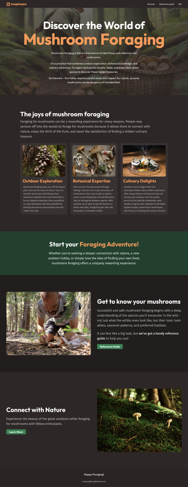

# 🍄 Mushroom Foraging Website

Welcome to the **Mushroom Foraging Website** repository! This project is a beautifully designed landing page that introduces users to the exciting world of mushroom foraging. The design is sleek, engaging, and perfect for nature enthusiasts, foragers, and culinary adventurers. 🌿🍽️

## 🌟 Features

✅ **Stunning UI/UX** - A visually appealing design with smooth typography and a well-structured layout.
✅ **Informative Sections** - Covers outdoor exploration, botanical expertise, and culinary delights.
✅ **Call to Action** - Encourages users to start their foraging adventure with clear, compelling CTAs.
✅ **Mobile-Responsive** - Optimized for seamless browsing on any device.
✅ **Engaging Visuals** - High-quality images that enhance user experience.

## 📸 Design Preview



## 🛠️ Tech Stack
This project can be implemented using the following technologies:

- **Frontend:** HTML, CSS, JavaScript 

## 🚀 Getting Started
To set up the project locally, follow these steps:

1. **Clone the repository**
   ```bash
   git clone https://github.com/sajida-dev/mushroom-foraging.git
   ```
2. **Navigate to the project directory**
   ```bash
   cd mushroom-foraging
   ```
3. **Open `index.html` in your browser** (for a static implementation)

## 💡 Contributing
If you'd like to contribute to this project, feel free to fork the repo and submit a pull request. Feedback and improvements are always welcome!

Happy Foraging! 🍄

